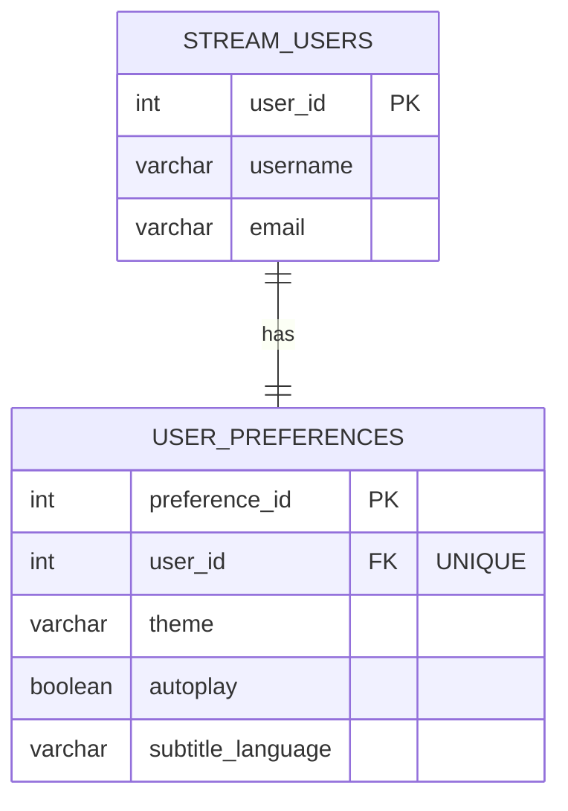
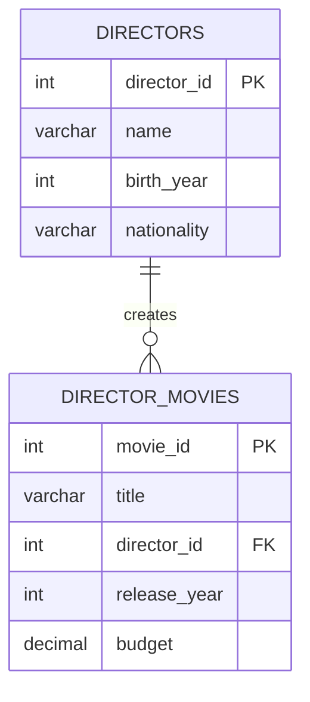
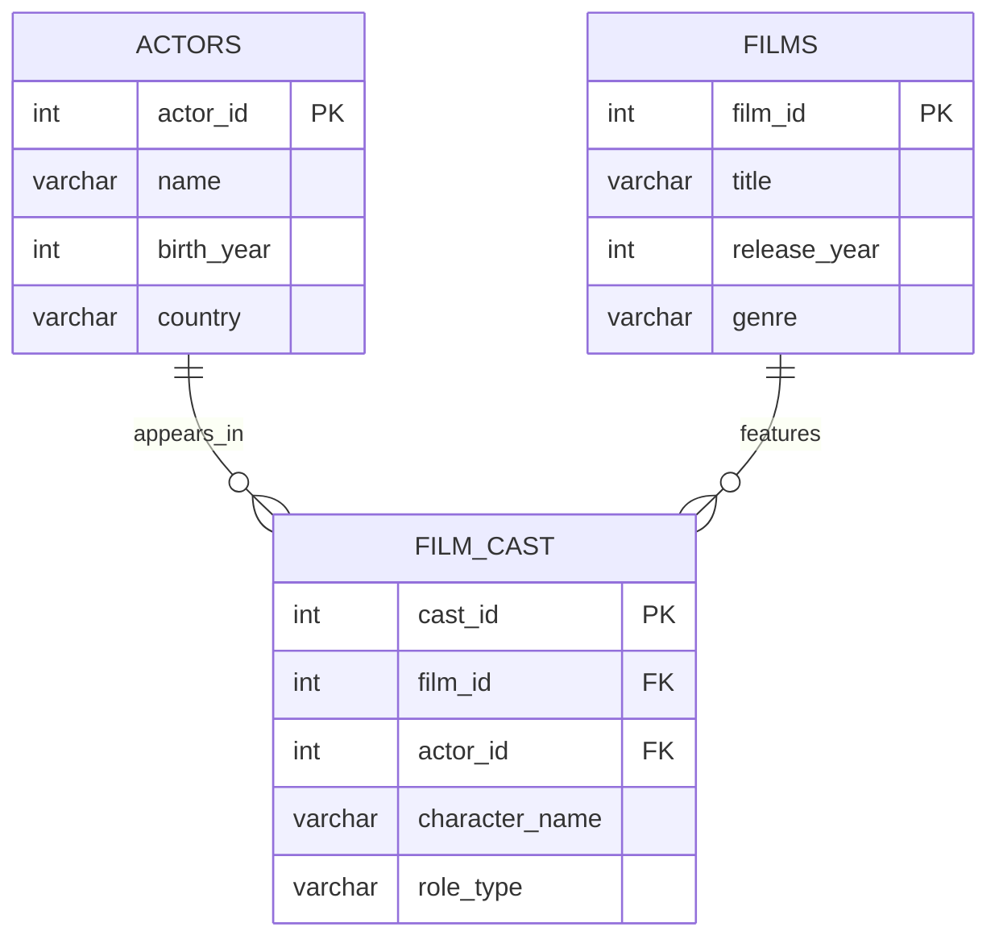
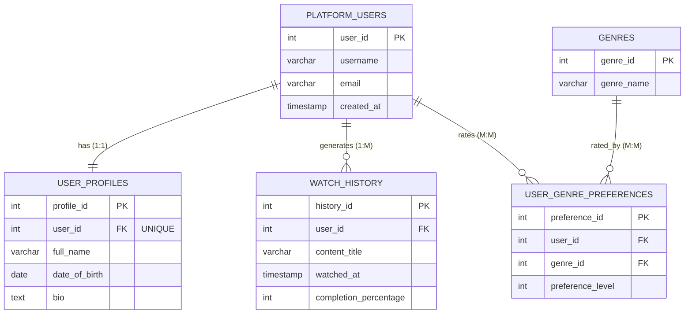

# PostgreSQL: ALTER, CASE Expressions, and Database Relationships

A comprehensive guide with practical examples using a **Movie Streaming Platform** database.

---

## 1. ALTER TABLE Commands

The `ALTER TABLE` command modifies existing table structures without losing data.

### 1.1 Adding Columns

```sql
-- Create our base table
CREATE TABLE movies (
    movie_id SERIAL PRIMARY KEY,
    title VARCHAR(200) NOT NULL,
    release_year INTEGER
);

-- Add a new column
ALTER TABLE movies
ADD COLUMN director VARCHAR(100);

-- Add multiple columns at once
ALTER TABLE movies
ADD COLUMN budget DECIMAL(12, 2),
ADD COLUMN box_office DECIMAL(12, 2);

-- Add column with default value
ALTER TABLE movies
ADD COLUMN rating VARCHAR(10) DEFAULT 'PG-13';

-- Add column with NOT NULL constraint (must provide default or populate existing rows)
ALTER TABLE movies
ADD COLUMN duration_minutes INTEGER NOT NULL DEFAULT 120;
```

### 1.2 Dropping Columns

```sql
-- Drop a single column
ALTER TABLE movies
DROP COLUMN budget;

-- Drop multiple columns
ALTER TABLE movies
DROP COLUMN box_office,
DROP COLUMN duration_minutes;

-- Drop column with CASCADE (removes dependent objects)
ALTER TABLE movies
DROP COLUMN director CASCADE;
```

### 1.3 Renaming Columns

```sql
-- Rename a column
ALTER TABLE movies
RENAME COLUMN release_year TO year_released;

-- Rename multiple times to fix naming
ALTER TABLE movies
RENAME COLUMN title TO movie_title;

ALTER TABLE movies
RENAME COLUMN movie_title TO film_title;
```

### 1.4 Modifying Column Data Types

```sql
-- Change column type
ALTER TABLE movies
ALTER COLUMN year_released TYPE SMALLINT;

-- Change with USING clause for complex conversions
ALTER TABLE movies
ALTER COLUMN rating TYPE VARCHAR(20)
USING rating::VARCHAR(20);

-- Change column to allow more precision
ALTER TABLE movies
ALTER COLUMN year_released TYPE NUMERIC(4, 0);
```

### 1.5 Setting and Dropping DEFAULT Values

```sql
-- Set a default value
ALTER TABLE movies
ALTER COLUMN rating SET DEFAULT 'Not Rated';

-- Drop default value
ALTER TABLE movies
ALTER COLUMN rating DROP DEFAULT;

-- Set default with expression
ALTER TABLE movies
ADD COLUMN added_date DATE DEFAULT CURRENT_DATE;

-- Drop and reset default
ALTER TABLE movies
ALTER COLUMN added_date DROP DEFAULT;

ALTER TABLE movies
ALTER COLUMN added_date SET DEFAULT NOW();
```

### 1.6 Adding and Dropping NOT NULL Constraints

```sql
-- Add NOT NULL constraint (ensure no existing NULL values first)
ALTER TABLE movies
ALTER COLUMN film_title SET NOT NULL;

-- Drop NOT NULL constraint
ALTER TABLE movies
ALTER COLUMN rating DROP NOT NULL;

-- Example workflow: handle existing NULLs before adding constraint
UPDATE movies SET director = 'Unknown' WHERE director IS NULL;

ALTER TABLE movies
ALTER COLUMN director SET NOT NULL;

-- Set default for "unknown" and make NOT NULL
ALTER TABLE movies
ALTER COLUMN director SET DEFAULT 'Unknown';

ALTER TABLE movies
ALTER COLUMN director SET NOT NULL;
```

### 1.7 Renaming Tables

```sql
-- Rename the entire table
ALTER TABLE movies
RENAME TO films;

-- Rename it back
ALTER TABLE films
RENAME TO movies;
```

### 1.8 Complete Example: Building a Streaming Platform

```sql
-- Start with basic table
CREATE TABLE streaming_users (
    user_id SERIAL PRIMARY KEY,
    username VARCHAR(50)
);

-- Expand the structure
ALTER TABLE streaming_users
ADD COLUMN email VARCHAR(100),
ADD COLUMN signup_date DATE DEFAULT CURRENT_DATE,
ADD COLUMN subscription_type VARCHAR(20) DEFAULT 'free';

-- Make email required
ALTER TABLE streaming_users
ALTER COLUMN email SET NOT NULL;

-- Add payment information
ALTER TABLE streaming_users
ADD COLUMN payment_method VARCHAR(50),
ADD COLUMN last_payment_date DATE;

-- Rename for clarity
ALTER TABLE streaming_users
RENAME COLUMN subscription_type TO plan_type;

-- Drop unnecessary column
ALTER TABLE streaming_users
DROP COLUMN payment_method;

-- Change data type for optimization
ALTER TABLE streaming_users
ALTER COLUMN username TYPE VARCHAR(30);
```

---

## 2. CASE Expressions

CASE expressions allow conditional logic in SQL queries - like if/else statements.

### 2.1 Simple CASE Syntax

```sql
-- Create sample data
CREATE TABLE viewer_activity (
    activity_id SERIAL PRIMARY KEY,
    user_id INTEGER,
    movie_id INTEGER,
    watch_percentage INTEGER,
    watched_date DATE
);

INSERT INTO viewer_activity (user_id, movie_id, watch_percentage, watched_date) VALUES
(1, 101, 100, '2025-01-01'),
(2, 102, 45, '2025-01-02'),
(3, 103, 75, '2025-01-02'),
(4, 104, 20, '2025-01-03'),
(5, 105, 90, '2025-01-03');

-- Simple CASE: categorize viewing behavior
SELECT 
    activity_id,
    user_id,
    watch_percentage,
    CASE 
        WHEN watch_percentage >= 90 THEN 'Completed'
        WHEN watch_percentage >= 50 THEN 'Partial'
        WHEN watch_percentage >= 20 THEN 'Started'
        ELSE 'Barely Watched'
    END AS viewing_status
FROM viewer_activity;
```

### 2.2 CASE in SELECT with Multiple Conditions

```sql
-- Create movies table with ratings
CREATE TABLE platform_movies (
    movie_id SERIAL PRIMARY KEY,
    title VARCHAR(200),
    genre VARCHAR(50),
    rating DECIMAL(3, 1),
    release_year INTEGER,
    content_rating VARCHAR(10)
);

INSERT INTO platform_movies (title, genre, rating, release_year, content_rating) VALUES
('Stellar Voyage', 'Sci-Fi', 8.7, 2023, 'PG-13'),
('Dark Alley', 'Thriller', 7.2, 2022, 'R'),
('Laugh Factory', 'Comedy', 6.5, 2024, 'PG'),
('Epic Quest', 'Fantasy', 9.1, 2023, 'PG-13'),
('True Crime Story', 'Documentary', 8.0, 2024, 'R');

-- Complex CASE with multiple conditions
SELECT 
    title,
    rating,
    content_rating,
    CASE 
        WHEN rating >= 9.0 THEN 'Must Watch'
        WHEN rating >= 8.0 AND content_rating IN ('PG', 'PG-13') THEN 'Family Friendly Hit'
        WHEN rating >= 7.0 THEN 'Worth Watching'
        WHEN rating >= 6.0 THEN 'Average'
        ELSE 'Skip'
    END AS recommendation,
    CASE 
        WHEN release_year >= 2024 THEN 'New Release'
        WHEN release_year >= 2022 THEN 'Recent'
        ELSE 'Catalog'
    END AS recency
FROM platform_movies;
```

### 2.3 CASE in WHERE Clause

```sql
-- Find movies based on conditional criteria
SELECT 
    title,
    genre,
    rating
FROM platform_movies
WHERE 
    CASE 
        WHEN genre = 'Documentary' THEN rating >= 7.5
        WHEN genre = 'Comedy' THEN rating >= 6.0
        ELSE rating >= 8.0
    END;
```

### 2.4 CASE in ORDER BY

```sql
-- Custom sorting logic
SELECT 
    title,
    genre,
    rating
FROM platform_movies
ORDER BY 
    CASE 
        WHEN genre = 'Fantasy' THEN 1
        WHEN genre = 'Sci-Fi' THEN 2
        WHEN genre = 'Thriller' THEN 3
        ELSE 4
    END,
    rating DESC;
```

### 2.5 CASE in Aggregations

```sql
-- Count movies by category
SELECT 
    COUNT(*) AS total_movies,
    COUNT(CASE WHEN rating >= 8.0 THEN 1 END) AS highly_rated,
    COUNT(CASE WHEN rating < 7.0 THEN 1 END) AS low_rated,
    COUNT(CASE WHEN content_rating = 'R' THEN 1 END) AS mature_content
FROM platform_movies;

-- Calculate average rating by content category
SELECT 
    content_rating,
    AVG(CASE WHEN genre = 'Sci-Fi' THEN rating END) AS avg_scifi_rating,
    AVG(CASE WHEN genre = 'Comedy' THEN rating END) AS avg_comedy_rating,
    AVG(rating) AS overall_avg
FROM platform_movies
GROUP BY content_rating;
```

### 2.6 Nested CASE Expressions

```sql
-- Complex recommendation engine
SELECT 
    title,
    genre,
    rating,
    release_year,
    CASE 
        WHEN rating >= 8.5 THEN
            CASE 
                WHEN release_year >= 2024 THEN 'Trending Masterpiece'
                WHEN release_year >= 2022 THEN 'Recent Classic'
                ELSE 'Timeless Gem'
            END
        WHEN rating >= 7.0 THEN
            CASE 
                WHEN genre IN ('Sci-Fi', 'Fantasy') THEN 'Solid Genre Pick'
                ELSE 'Good Watch'
            END
        ELSE 'Filler Content'
    END AS platform_tag
FROM platform_movies;
```

### 2.7 CASE with UPDATE

```sql
-- Update records conditionally
UPDATE platform_movies
SET content_rating = 
    CASE 
        WHEN rating >= 8.0 AND content_rating = 'R' THEN 'R - Premium'
        WHEN rating < 6.5 THEN content_rating || ' - Limited'
        ELSE content_rating
    END;

-- Verify the update
SELECT title, rating, content_rating FROM platform_movies;
```

### 2.8 CASE with INSERT

```sql
-- Insert with conditional values
INSERT INTO platform_movies (title, genre, rating, release_year, content_rating)
VALUES 
    ('New Action Film', 'Action', 7.5, 2025,
     CASE 
         WHEN 7.5 >= 8.0 THEN 'Premium'
         ELSE 'Standard'
     END);
```

---

## 3. Understanding Database Relationships

Relationships define how tables connect to each other using PRIMARY KEY and FOREIGN KEY constraints.

### 3.1 ONE-TO-ONE Relationship

**Definition:** One record in Table A relates to exactly **one** record in Table B.

**Example:** Each user has one profile with detailed settings.

```sql
CREATE TABLE stream_users (
    user_id SERIAL PRIMARY KEY,
    username VARCHAR(50) NOT NULL,
    email VARCHAR(100) UNIQUE NOT NULL
);

CREATE TABLE user_preferences (
    preference_id SERIAL PRIMARY KEY,
    user_id INTEGER UNIQUE NOT NULL,  -- UNIQUE makes it one-to-one
    theme VARCHAR(20) DEFAULT 'dark',
    autoplay BOOLEAN DEFAULT true,
    subtitle_language VARCHAR(20) DEFAULT 'English',
    FOREIGN KEY (user_id) REFERENCES stream_users(user_id) ON DELETE CASCADE
);

-- Insert data
INSERT INTO stream_users (username, email) VALUES
('cinephile_jane', 'jane@email.com'),
('binge_watcher_bob', 'bob@email.com');

INSERT INTO user_preferences (user_id, theme, autoplay) VALUES
(1, 'dark', true),
(2, 'light', false);

-- View user with their preferences
SELECT * FROM stream_users;
SELECT * FROM user_preferences;
```

**Key Points:**
- The `UNIQUE` constraint on `user_id` in `user_preferences` ensures each user can have only ONE preference record
- `ON DELETE CASCADE` means if a user is deleted, their preferences are automatically deleted too

**Mermaid Diagram:**



### 3.2 ONE-TO-MANY Relationship

**Definition:** One record in Table A relates to **multiple** records in Table B.

**Example:** One director creates many movies.

```sql
CREATE TABLE directors (
    director_id SERIAL PRIMARY KEY,
    name VARCHAR(100) NOT NULL,
    birth_year INTEGER,
    nationality VARCHAR(50)
);

CREATE TABLE director_movies (
    movie_id SERIAL PRIMARY KEY,
    title VARCHAR(200) NOT NULL,
    director_id INTEGER NOT NULL,  -- No UNIQUE here, allows multiple movies per director
    release_year INTEGER,
    budget DECIMAL(12, 2),
    FOREIGN KEY (director_id) REFERENCES directors(director_id) ON DELETE RESTRICT
);

-- Insert directors
INSERT INTO directors (name, birth_year, nationality) VALUES
('Christopher Nolan', 1970, 'British-American'),
('Greta Gerwig', 1983, 'American'),
('Denis Villeneuve', 1967, 'Canadian');

-- Insert movies (multiple movies per director)
INSERT INTO director_movies (title, director_id, release_year, budget) VALUES
('Inception', 1, 2010, 160000000),
('Interstellar', 1, 2014, 165000000),
('Dunkirk', 1, 2017, 100000000),
('Lady Bird', 2, 2017, 10000000),
('Little Women', 2, 2019, 40000000),
('Arrival', 3, 2016, 47000000),
('Blade Runner 2049', 3, 2017, 150000000);

-- View all directors
SELECT * FROM directors;

-- View all movies
SELECT * FROM director_movies;

-- Count movies per director
SELECT 
    director_id,
    COUNT(*) AS movie_count
FROM director_movies
GROUP BY director_id;
```

**Key Points:**
- No `UNIQUE` constraint on `director_id` in `director_movies` - allows multiple movies per director
- `ON DELETE RESTRICT` prevents deleting a director if they have movies
- One director (parent) can have many movies (children)

**Mermaid Diagram:**



### 3.3 MANY-TO-MANY Relationship

**Definition:** Multiple records in Table A relate to multiple records in Table B.

**Example:** Movies have multiple actors, and actors appear in multiple movies.

**Important:** Many-to-many relationships require a **junction table** (also called bridge/linking table) that sits between the two main tables.

```sql
-- First main table
CREATE TABLE actors (
    actor_id SERIAL PRIMARY KEY,
    name VARCHAR(100) NOT NULL,
    birth_year INTEGER,
    country VARCHAR(50)
);

-- Second main table
CREATE TABLE films (
    film_id SERIAL PRIMARY KEY,
    title VARCHAR(200) NOT NULL,
    release_year INTEGER,
    genre VARCHAR(50)
);

-- Junction table (bridges the many-to-many relationship)
CREATE TABLE film_cast (
    cast_id SERIAL PRIMARY KEY,
    film_id INTEGER NOT NULL,
    actor_id INTEGER NOT NULL,
    character_name VARCHAR(100),
    role_type VARCHAR(20) DEFAULT 'supporting',
    FOREIGN KEY (film_id) REFERENCES films(film_id) ON DELETE CASCADE,
    FOREIGN KEY (actor_id) REFERENCES actors(actor_id) ON DELETE CASCADE,
    UNIQUE(film_id, actor_id)  -- Prevents same actor being cast twice in same film
);

-- Insert actors
INSERT INTO actors (name, birth_year, country) VALUES
('Leonardo DiCaprio', 1974, 'USA'),
('Marion Cotillard', 1975, 'France'),
('Tom Hardy', 1977, 'UK'),
('Anne Hathaway', 1982, 'USA'),
('Matthew McConaughey', 1969, 'USA');

-- Insert films
INSERT INTO films (title, release_year, genre) VALUES
('Inception', 2010, 'Sci-Fi'),
('The Dark Knight Rises', 2012, 'Action'),
('Interstellar', 2014, 'Sci-Fi'),
('Dunkirk', 2017, 'War');

-- Create the many-to-many relationships through the junction table
INSERT INTO film_cast (film_id, actor_id, character_name, role_type) VALUES
-- Inception has 3 actors
(1, 1, 'Dom Cobb', 'lead'),
(1, 2, 'Mal Cobb', 'supporting'),
(1, 3, 'Eames', 'supporting'),
-- The Dark Knight Rises has 2 actors
(2, 3, 'Bane', 'lead'),
(2, 4, 'Catwoman', 'lead'),
-- Interstellar has 2 actors
(3, 4, 'Brand', 'supporting'),
(3, 5, 'Cooper', 'lead'),
-- Dunkirk has 1 actor
(4, 3, 'Farrier', 'supporting');

-- View all actors
SELECT * FROM actors;

-- View all films
SELECT * FROM films;

-- View all casting relationships
SELECT * FROM film_cast;

-- Find how many films each actor has
SELECT 
    actor_id,
    COUNT(*) AS film_count
FROM film_cast
GROUP BY actor_id
ORDER BY film_count DESC;

-- Find how many actors each film has
SELECT 
    film_id,
    COUNT(*) AS actor_count
FROM film_cast
GROUP BY film_id
ORDER BY actor_count DESC;
```

**Key Points:**
- `film_cast` is the junction table that connects `films` and `actors`
- Junction table has foreign keys to both main tables
- Junction table can store additional information (like `character_name`, `role_type`)
- `UNIQUE(film_id, actor_id)` prevents duplicate casting
- Allows many-to-many: one actor in many films, one film with many actors

**Mermaid Diagram:**



---

## 4. PRIMARY KEY and FOREIGN KEY

### 4.1 PRIMARY KEY

A PRIMARY KEY uniquely identifies each record in a table.

**Rules:**
- Must contain **unique** values (no duplicates)
- Cannot contain **NULL** values
- Each table can have only **ONE** primary key
- Can consist of single or multiple columns (composite key)

**Why use Primary Keys?**
- Ensures each row is unique
- Provides fast data lookup
- Used by Foreign Keys to create relationships

```sql
-- Single column primary key (most common)
CREATE TABLE streaming_platforms (
    platform_id SERIAL PRIMARY KEY,  -- Auto-incrementing primary key
    platform_name VARCHAR(50) NOT NULL,
    founded_year INTEGER
);

INSERT INTO streaming_platforms (platform_name, founded_year) VALUES
('StreamFlix', 2010),
('WatchNow', 2015),
('VideoHub', 2018);

SELECT * FROM streaming_platforms;

-- Composite primary key (multiple columns together form the key)
CREATE TABLE subscription_history (
    user_id INTEGER,
    plan_change_date DATE,
    new_plan VARCHAR(30),
    PRIMARY KEY (user_id, plan_change_date)  -- Both columns together are unique
);

INSERT INTO subscription_history VALUES
(1, '2024-01-15', 'Basic'),
(1, '2024-06-20', 'Premium'),  -- Same user, different date (allowed)
(2, '2024-01-15', 'Standard'); -- Different user, same date (allowed)
-- (1, '2024-01-15', 'Pro') would fail - duplicate composite key

SELECT * FROM subscription_history;

-- Adding primary key to existing table
CREATE TABLE content_ratings (
    rating_code VARCHAR(10),
    description TEXT
);

-- Add primary key constraint after table creation
ALTER TABLE content_ratings
ADD PRIMARY KEY (rating_code);

INSERT INTO content_ratings VALUES
('G', 'General Audiences'),
('PG', 'Parental Guidance'),
('PG-13', 'Parents Strongly Cautioned'),
('R', 'Restricted');

SELECT * FROM content_ratings;
```

### 4.2 FOREIGN KEY

A FOREIGN KEY creates a link between two tables by referencing the primary key of another table.

**Rules:**
- Must reference a **PRIMARY KEY** or **UNIQUE** column in another table
- Can contain **NULL** values (unless specified NOT NULL)
- Multiple foreign keys can exist in one table
- Enforces **referential integrity** (can't reference non-existent records)

**Why use Foreign Keys?**
- Maintains data consistency
- Prevents orphaned records
- Enforces valid relationships between tables

```sql
-- Parent table (must be created first)
CREATE TABLE subscribers (
    subscriber_id SERIAL PRIMARY KEY,
    email VARCHAR(100) UNIQUE NOT NULL,
    username VARCHAR(50) NOT NULL,
    join_date DATE DEFAULT CURRENT_DATE
);

-- Another parent table
CREATE TABLE subscription_plans (
    plan_id SERIAL PRIMARY KEY,
    plan_name VARCHAR(30) NOT NULL,
    monthly_price DECIMAL(5, 2) NOT NULL,
    max_screens INTEGER DEFAULT 1
);

-- Child table with foreign keys
CREATE TABLE active_subscriptions (
    subscription_id SERIAL PRIMARY KEY,
    subscriber_id INTEGER NOT NULL,
    plan_id INTEGER NOT NULL,
    start_date DATE DEFAULT CURRENT_DATE,
    auto_renew BOOLEAN DEFAULT true,
    
    -- Foreign key constraints
    FOREIGN KEY (subscriber_id) REFERENCES subscribers(subscriber_id),
    FOREIGN KEY (plan_id) REFERENCES subscription_plans(plan_id)
);

-- Insert parent data first
INSERT INTO subscribers (email, username) VALUES
('alice@example.com', 'alice_movies'),
('bob@example.com', 'bob_streams');

INSERT INTO subscription_plans (plan_name, monthly_price, max_screens) VALUES
('Basic', 9.99, 1),
('Standard', 14.99, 2),
('Premium', 19.99, 4);

-- Now insert child data (referencing parent IDs)
INSERT INTO active_subscriptions (subscriber_id, plan_id) VALUES
(1, 3),  -- Alice has Premium plan
(2, 2);  -- Bob has Standard plan

-- This would fail - subscriber_id 999 doesn't exist
-- INSERT INTO active_subscriptions (subscriber_id, plan_id) VALUES (999, 1);

-- View the data
SELECT * FROM subscribers;
SELECT * FROM subscription_plans;
SELECT * FROM active_subscriptions;
```

### 4.3 Foreign Key Actions (ON DELETE and ON UPDATE)

These control what happens to child records when parent records are modified or deleted.

```sql
-- ON DELETE CASCADE: Delete child records when parent is deleted
CREATE TABLE streaming_devices (
    device_id SERIAL PRIMARY KEY,
    subscriber_id INTEGER NOT NULL,
    device_name VARCHAR(50),
    device_type VARCHAR(30),
    registered_date DATE DEFAULT CURRENT_DATE,
    
    FOREIGN KEY (subscriber_id) REFERENCES subscribers(subscriber_id) 
        ON DELETE CASCADE  -- If subscriber deleted, delete their devices too
        ON UPDATE CASCADE  -- If subscriber_id changes, update device records
);

INSERT INTO streaming_devices (subscriber_id, device_name, device_type) VALUES
(1, 'Living Room TV', 'Smart TV'),
(1, 'iPhone 12', 'Mobile'),
(2, 'Laptop', 'Computer');

-- If we delete subscriber 1, their 2 devices are automatically deleted
-- DELETE FROM subscribers WHERE subscriber_id = 1;

-- ON DELETE SET NULL: Keep child records but remove parent reference
CREATE TABLE watchlist (
    watchlist_id SERIAL PRIMARY KEY,
    subscriber_id INTEGER,
    movie_title VARCHAR(200),
    added_date TIMESTAMP DEFAULT CURRENT_TIMESTAMP,
    priority INTEGER DEFAULT 5,
    
    FOREIGN KEY (subscriber_id) REFERENCES subscribers(subscriber_id) 
        ON DELETE SET NULL  -- If subscriber deleted, keep watchlist but set subscriber_id to NULL
);

INSERT INTO watchlist (subscriber_id, movie_title, priority) VALUES
(1, 'Inception', 10),
(2, 'Interstellar', 8);

-- If we delete subscriber 1, their watchlist entry remains but subscriber_id becomes NULL

-- ON DELETE RESTRICT: Prevent deletion if child records exist
CREATE TABLE payment_methods (
    payment_id SERIAL PRIMARY KEY,
    subscriber_id INTEGER NOT NULL,
    card_type VARCHAR(20),
    card_last_four CHAR(4),
    expiry_date DATE,
    
    FOREIGN KEY (subscriber_id) REFERENCES subscribers(subscriber_id) 
        ON DELETE RESTRICT  -- Cannot delete subscriber if they have payment methods
);

INSERT INTO payment_methods (subscriber_id, card_type, card_last_four, expiry_date) VALUES
(1, 'Visa', '1234', '2026-12-31'),
(2, 'Mastercard', '5678', '2027-06-30');

-- This would fail - cannot delete subscriber because payment method exists
-- DELETE FROM subscribers WHERE subscriber_id = 1;
-- Must delete payment method first, then subscriber

-- ON DELETE NO ACTION (default): Similar to RESTRICT
-- ON DELETE SET DEFAULT: Set to default value when parent is deleted

SELECT * FROM streaming_devices;
SELECT * FROM watchlist;
SELECT * FROM payment_methods;
```

**Foreign Key Actions Summary:**

| Action | Effect |
|--------|--------|
| `CASCADE` | Delete/update child records automatically |
| `SET NULL` | Set foreign key to NULL in child records |
| `SET DEFAULT` | Set foreign key to default value in child records |
| `RESTRICT` | Prevent parent deletion if children exist (checked immediately) |
| `NO ACTION` | Prevent parent deletion if children exist (checked at end of statement) |

### 4.4 Complete Relationship Example

Here's a complete streaming platform database demonstrating all three relationship types:

```sql
-- Users (main table)
CREATE TABLE platform_users (
    user_id SERIAL PRIMARY KEY,
    username VARCHAR(50) UNIQUE NOT NULL,
    email VARCHAR(100) UNIQUE NOT NULL,
    created_at TIMESTAMP DEFAULT CURRENT_TIMESTAMP
);

-- One-to-One: User Profile (each user has ONE profile)
CREATE TABLE user_profiles (
    profile_id SERIAL PRIMARY KEY,
    user_id INTEGER UNIQUE NOT NULL,  -- UNIQUE makes it one-to-one
    full_name VARCHAR(100),
    date_of_birth DATE,
    bio TEXT,
    FOREIGN KEY (user_id) REFERENCES platform_users(user_id) ON DELETE CASCADE
);

-- One-to-Many: User Watch History (each user has MANY watch records)
CREATE TABLE watch_history (
    history_id SERIAL PRIMARY KEY,
    user_id INTEGER NOT NULL,  -- No UNIQUE, allows multiple records per user
    content_title VARCHAR(200),
    watched_at TIMESTAMP DEFAULT CURRENT_TIMESTAMP,
    completion_percentage INTEGER,
    FOREIGN KEY (user_id) REFERENCES platform_users(user_id) ON DELETE CASCADE
);

-- Many-to-Many Setup: Users and Genres (users like MANY genres, genres liked by MANY users)
CREATE TABLE genres (
    genre_id SERIAL PRIMARY KEY,
    genre_name VARCHAR(50) UNIQUE NOT NULL
);

-- Junction table for many-to-many
CREATE TABLE user_genre_preferences (
    preference_id SERIAL PRIMARY KEY,
    user_id INTEGER NOT NULL,
    genre_id INTEGER NOT NULL,
    preference_level INTEGER CHECK (preference_level BETWEEN 1 AND 10),
    FOREIGN KEY (user_id) REFERENCES platform_users(user_id) ON DELETE CASCADE,
    FOREIGN KEY (genre_id) REFERENCES genres(genre_id) ON DELETE CASCADE,
    UNIQUE(user_id, genre_id)  -- Each user can rate each genre only once
);

-- Insert sample data
INSERT INTO platform_users (username, email) VALUES
('movie_buff', 'buff@example.com'),
('series_fan', 'fan@example.com');

INSERT INTO user_profiles (user_id, full_name, date_of_birth) VALUES
(1, 'Alex Johnson', '1990-05-15'),
(2, 'Sam Williams', '1985-08-22');

INSERT INTO watch_history (user_id, content_title, completion_percentage) VALUES
(1, 'Stellar Voyage', 100),
(1, 'Epic Quest', 67),
(1, 'Dark Alley', 45),
(2, 'True Crime Story', 100),
(2, 'Laugh Factory', 80);

INSERT INTO genres (genre_name) VALUES
('Sci-Fi'), ('Fantasy'), ('Thriller'), ('Documentary'), ('Comedy');

INSERT INTO user_genre_preferences (user_id, genre_id, preference_level) VALUES
(1, 1, 9),  -- movie_buff loves Sci-Fi (9/10)
(1, 2, 8),  -- movie_buff likes Fantasy (8/10)
(1, 3, 6),  -- movie_buff neutral on Thriller (6/10)
(2, 3, 9),  -- series_fan loves Thriller (9/10)
(2, 4, 7),  -- series_fan likes Documentary (7/10)
(2, 5, 8);  -- series_fan likes Comedy (8/10)

-- View all data
SELECT * FROM platform_users;
SELECT * FROM user_profiles;
SELECT * FROM watch_history;
SELECT * FROM genres;
SELECT * FROM user_genre_preferences;

-- Count watch history per user
SELECT 
    user_id,
    COUNT(*) AS total_watched,
    AVG(completion_percentage) AS avg_completion
FROM watch_history
GROUP BY user_id;

-- Count genre preferences per user
SELECT 
    user_id,
    COUNT(*) AS genres_rated,
    AVG(preference_level) AS avg_preference
FROM user_genre_preferences
GROUP BY user_id;
```

**Complete System Diagram:**


